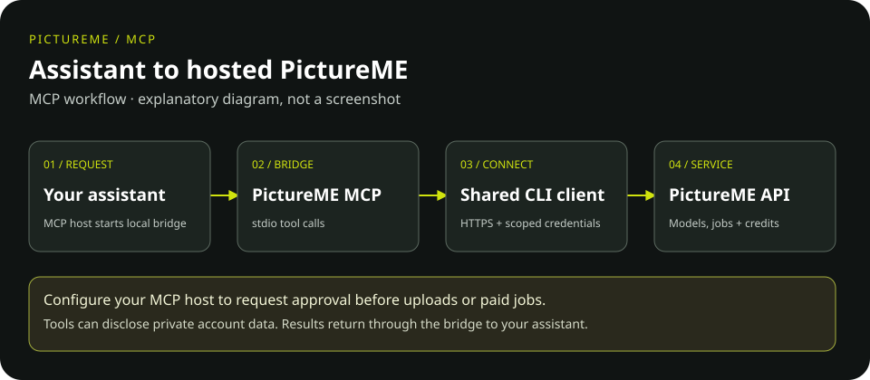

<picture>
  <source media="(prefers-color-scheme: dark)" srcset="docs/assets/pictureme-lockup-dark.svg">
  <source media="(prefers-color-scheme: light)" srcset="docs/assets/pictureme-lockup-light.svg">
  
</picture>

# PictureME MCP

Let a compatible AI assistant use PictureME tools: discover image and video
models, upload local reference media, submit generation jobs, and check job
status and credit balances. This is a local tool bridge to the hosted PictureME
API, not a model runner or a self-hosted backend.

## Who is it for?

People using an MCP-capable assistant and developers connecting assistants to
PictureME. MCP means **Model Context Protocol**: a standard way for an assistant
to call tools. This server communicates through standard input/output (stdio),
so your MCP host launches it as a local process.

**MCP or CLI?** Use this bridge for assistant tool calls. Use the
[PictureME CLI](https://github.com/Pachecodes/pictureme-cli-public) for commands
you type in a terminal or run in scripts. MCP reuses that CLI's HTTP client.

## How it works



*Explanatory diagram, not a screenshot. Your host must enforce approval;
this bridge does not automatically ask permission before a tool call.*

## Install

Requires **Python 3.10+** and an approved CLI artifact installed first.
From a reviewed MCP checkout, use a fresh environment:

```bash
python -m venv .venv
source .venv/bin/activate
python -m pip install /path/to/approved/pictureme_cli-0.1.0-py3-none-any.whl
python -m pip install .
python -m pip check
```

Replace the wheel path with your reviewed, SHA-256-verified artifact. Do not assume
an index package with the same name is ours. [Installation](docs/installation.md)
covers pinned commits, wheel-only installs and dependency-replacement hazards.

## Connect your assistant

Run `pictureme auth login` in a trusted terminal and approve it in your browser.
Add this to your host's MCP configuration, replacing the executable path:

```json
{
  "mcpServers": {
    "pictureme": {
      "command": "/path/to/venv/bin/pictureme-mcp",
      "env": {"PICTUREME_HOST": "https://go.pictureme.now"}
    }
  }
}
```

Your host starts the bridge. Never put a real API key in committed JSON.
See [configuration and credentials](docs/configuration.md) for safe alternatives.

## Example: find an image model

Ask your assistant: **“List PictureME image models. Do not upload anything or
create a generation.”** It can call `pictureme_model_list(image_only=true)`
then `pictureme_model_get(model_id=...)` to inspect a chosen model's inputs.
This example reads the catalog; it does not spend generation credits.

For generation, have the assistant present a nonbinding estimate and the exact
prompt/media first. Approve uploads and paid submission explicitly, then inspect
the final job status. See the [tool and authorization guide](docs/tools.md).

## Account, credits and privacy

Authenticated tools need a PictureME account, service access, scopes and credits.
Paid generation spends credits; cancellation guarantees neither a stop nor a
refund. Local-file uploads disclose their contents. Read tools can share private
account/job data with your assistant: use only trusted hosts and restrict files.
Saved POSIX credentials are mode-0600 plaintext, not encrypted. No admin tool is
exposed. MIT licensing grants neither service access nor credits.

## Documentation

- [Manual and reading guide](docs/README.md)
- [Installation](docs/installation.md) and [host configuration](docs/configuration.md)
- [Tools, estimates and authorization](docs/tools.md)
- [Development and offline tests](docs/development.md)
- [Brand assets and rights](docs/brand-assets.md)

## Project and license

Maintained by **Jesus Pacheco / Akitá Labs**.
[Contributing](CONTRIBUTING.md) · [Security policy](SECURITY.md) ·
[Provenance](PROVENANCE.md) · [MIT code license](LICENSE).
Logo/trademark rights and hosted-service terms are separate from the code license.
